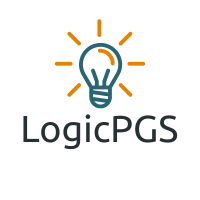

# AuroraLD Studio
AuroraLD Studio is a ladder logic and SCADA software for Arduino and compatible boards with serial communication. This software has basic instructions for ladder programming and are similar to Studio 5000 from Rockwell Automation. It has been coded in Processing and is completely free. The purpose of the software is to help students learn about PLC programming and SCADA systems not only by simulation but also by implementing low cost projects using development boards like Arduino.

# Attribution and Libraries
In order to develop this software many images, sounds, icons and libraries have been used:

 -Program icons (tools) - Icons by https://icons8.com
 
 -Alarm sounds and loading music - Free music for non commercial use from https: //fesliyanstudios.com
 
 -Sound library by The processing Foundation
 
 -ControlP5 library by Andreas Schlegel
 
 -QScript library by Peter Lager
 
 -Swing (Java)
 
# Tutorials
Check LogicPGS youtube channel for tutorials

https://www.youtube.com/channel/UCBwRfFjgCiSxVayGX6VGDiw

# Developer
LogicPGS by Diego Medina
Peru - 2020

# Version
v1.9
