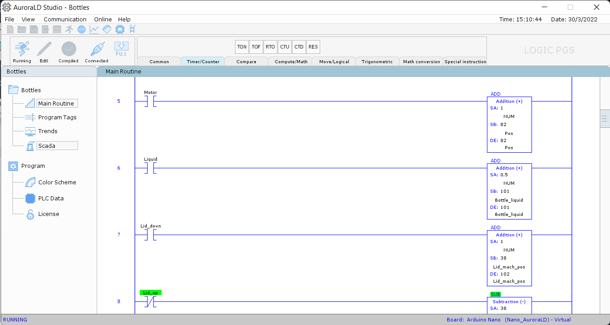

# AuroraLD Studio
AuroraLD Studio is a ladder logic and SCADA software for Arduino and compatible boards with serial communication. This software has basic instructions for ladder programming and are similar to Studio 5000 from Rockwell Automation. It has been coded in Processing and is completely free. The purpose of the software is to help students learn about PLC programming and SCADA systems not only by simulation but also by implementing low cost projects using development boards like Arduino.

* An AuroraLD Studio project (`.ara.`) can be exported to .ino file.
* This software requires the `Arduino IDE` software if you want to upload your project.

## Attribution and Libraries
In order to develop this software many images, sounds, icons and libraries have been used:

* Program icons (tools) - [Icons8](https://icons8.com)
 
* Alarm sounds and loading music - Free music for non commercial use from [fesliyanstudios](https: //fesliyanstudios.com)
 
* Sound library by The processing Foundation
 
* ControlP5 library by Andreas Schlegel
 
* [QScript](http://www.lagers.org.uk/qscript/) library by Peter Lager
 
* Swing (Java)

## About
When loading the software the following screen will be displayed:

Different ladder instructions are available and easy to use inside the ladder environment:

Configure your tags in order to view them in the trend environment in real time:

Create an SCADA using the predefined elements. Each element has its own parameters and there are 6 global animations for almost every element.

 
## Tutorials
* Check [LogicPGS](https://www.youtube.com/channel/UCBwRfFjgCiSxVayGX6VGDiw) youtube channel for tutorials `(spanish)`.

* One the software is installed you can check the folder named `files` in the installation directory. That folder contains 4 manuals related to the software. The manuals are in `english`.

## Add a board to AuroraLD Studio
If you want to add a new board in AuroraLD Studio you need to create a file with the extension `.aeds`.

* I have a video in `spanish` where I explain how to create this file, you can go to that video using the following [link](https://www.youtube.com/watch?v=NvcX7z2sDFM)

* To see the basic structure of the `.aeds` file, [click here](https://gist.github.com/dmedina09/22432591cf600d8e50e93ad1cbb729a5)

* To see an example of the `.aeds` file for the raspberry pi pico [click here](https://gist.github.com/dmedina09/76b7b021d1d5cdafa3c613a3885ec639)

`You can use any text editor to create this file.`

* Aditionally you can add an image for your board. This image should be located in the data folder in the directory where the software has been installed. The width and height of the image `(in pixels)` should be specified in the `.aeds` file.

To connect the board to AuroraLD Studio you can go to this [video](https://www.youtube.com/watch?v=yB_yUZlfvEE&t=65s) or follow these steps:

* Once you have imported the `.aeds` file into AuroraLD Studio you need to generate the controller under the communication tab.

* Upload the generated file using `Arduino IDE.`

* Connect it to AuroraLD Studio and you are done.

## Developer
* LogicPGS by Diego Medina

## Version
v1.8